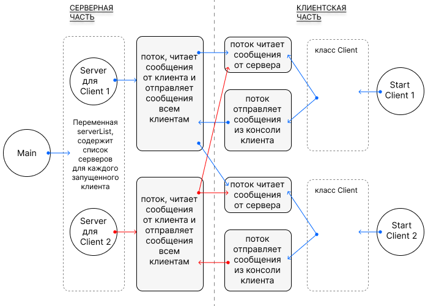
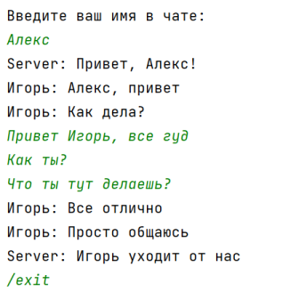
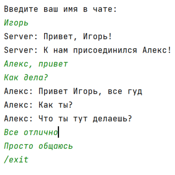

# Курсовая работа "Сетевой чат"
## Общая схема работы программы

## Описание файлов и методов
### Logger.java
- метод log, пишет дату, отправителя сообщения, сообщение в файл file.log
- не переписывает файл, только добавляет информацию

### Main.java
- Создает файл настроек Setting.txt и записывает туда порт и адресс
- Создает список серверов serverList
- Запускает ServerSocket, который в бесконечном цикле добавляет новый сервер к каждому новому клиенту

### Server.java
`конструктор Server()`
- в конструкторе получает доступ к потокам ввода/вывода клиента, 
- запускает поток, который получает сообщения клиента и отправляет его сообщения остальным клиентам из списка serverList

`void run()`
- использует метод log класса Logger, ведет логирование
- получает сообщения от клиента
- отправляет сообщения клиенту, метод send
- отправляет сообщения клиентам, кроме приславшего сообщение, метод sendToAll
- если клиент прислал сообщение "/exit" , то закрывает все reader/writer, закрывает сокет клиента, 
- удаляет его из списка serverList, удаляет себя как поток, связанный с клиентом, метод downClient

### StartClient01.java
### StartClient02.java
- создают по экземпляру класса Client и передают туда путь к файлу настроек settings.txt

### Client.java
`метод setSettingsFromTxt`
- получает настройки из файла настроек settings.txt

`конструктор Client`
- получает доступ к потокам ввода/вывода сервера
- создает поток readMsg для получения и вывода на экран сообщений от сервера (других клиентов чата)
- создает поток writeMsg для получения сообщения из консоли и отправки его на сервер

`метод shutdownClient`
- прерывает все потоки клиента
- закрывает сокет

`void setNickname`
- считывает с консоли имя пользователя и отправляет на сервер

## Пример общения клиентов в чате
`client01`

`client02`

## Часть файла file.log

https://github.com/MedvedvJava/Network-Chat/blob/ed20704127ee4724e02dec05deb34d6f19419a41/src/main/resources/file.log#L210-L222
